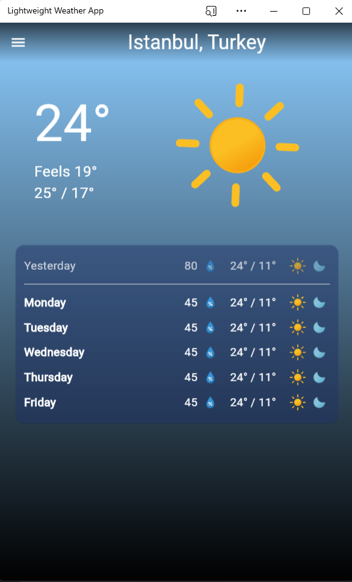

# WeatherApp

This is my first Flutter project that I developed with Backend.
Django is used in the background of this simple and easy to use Weather app.

<div align="center">
    
  </div>

## Installation

1. Create a new Flutter project:
```
flutter create weather_app
```

2. Clone the repository:
```
git clone https://github.com/OverBrave/WeatherApp.git
```

3. Test your changes by running the app on an emulator or a physical device:
```
flutter run
```

## Packages

- [hive](https://pub.dev/packages/hive) - Save for the user’s selected city in device’s storage.
- [lottie](https://pub.dev/packages/lottie) - To use animated icons in an app.
- [screenutil](https://pub.dev/packages/flutter_screenutil) - To make a responsive design for an app.
